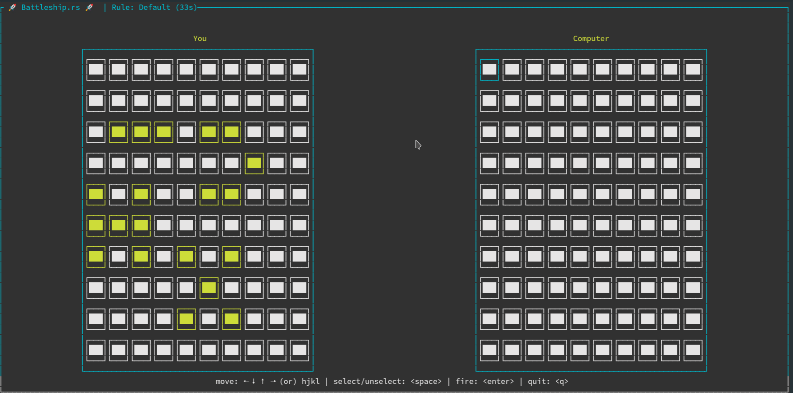

# BattleShip.rs

A terminal battleship game in Rust.

Run with docker:

```
$ docker run --rm -it deepu105/battleship:latest
```



This is slightly different than the traditional battleship game.

There are 4 types of ships that will be placed randomly at different rotations in each players board

- **Fighter** [X shaped]
- **Carrier** [H shaped]
- **Destroyer** [V shaped]
- **Scout** [I shaped]

There are 3 rules with which the game can be played. This can be passed as argument `-r <fury|charge>` to the CLI

- **Default**: Only one salvo/shot per turn
- **Fury**: You can select salvo/shot up to the number of ships alive in your board
- **Charge**: You start with one salvo/shot per turn and as you sunk opponent ships you get one additional shot per ship sunken

The default difficulty level is hard. You can set to easy difficulty by passing `-d <easy|hard>` to the CLI

pass `-h` for help

You can also clone the repo and run `cargo run`

**Note**: Works only in Linux/Mac for Windows use docker command above.

**TODO**: Make this work also in web assembly

UI inspired from https://github.com/cpcloud/minesweep-rs
